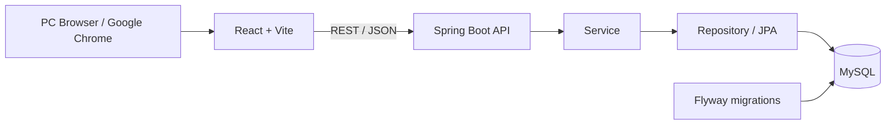
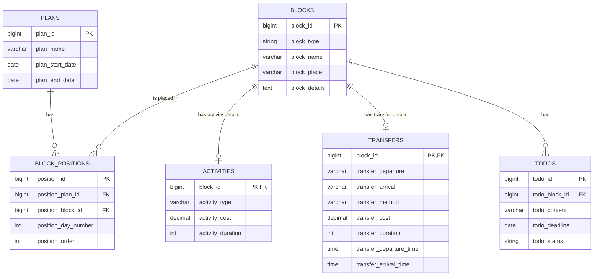

# ItiniBoard

**旅行プランをブロックでデザインし、複数の行程案を見比べるための旅行計画アプリ**

ItiniBoard は、個人で旅行のアクティビティや移動をブロックとして管理し、日ごとの行程に配置して検討する PC ブラウザ向け Web アプリケーションです。ブロックをドラッグ＆ドロップで配置・並び替えでき、複数プランの行程・費用・TODO を比較しやすくすることを目指しています。

> **実装状況（2026年8月時点）**: 
> 現在は、プラン一覧・比較表示、選択プランのTODO表示、行程画面での候補ブロックと
> 日別行程のドラッグ＆ドロップによる 配置／配置解除／並び替えまでを実装済。
> プラン・ブロック・TODOの作成／編集／複製／削除などのバックエンドAPIは実装済だが、
> これらを操作するフロントエンドUIは未接続または未実装。

## 目次

- [開発背景](#開発背景)
- [実装済み機能](#実装済み機能)
- [主な画面](#主な画面)
- [技術スタック](#技術スタック)
- [アーキテクチャ](#アーキテクチャ)
- [データベース設計](#データベース設計)
- [ローカル環境での起動](#ローカル環境での起動)
- [API](#api)
- [今後の実装予定](#今後の実装予定)

## 開発背景

旅行を計画するにあたって、複数の行き先候補やアクティビティを比較検討することがあります。
これらのアイディアをブロックとして管理し日程に当てはめることで、
行程の流れや予算、移動にかかる時間などが比較しやすくなると考えました。

## 実装済み機能

### フロントエンドで操作できる機能

| 機能 | 内容 |
| --- | --- |
| プラン一覧・比較 | 保存済みプランを一覧表示し、各プランの日程、日数、費用、行程を比較表示します。 |
| プラン選択 | 比較表からプランを選択し、選択中プランに紐付くTODOを表示できます。 |
| TODO表示 | 一覧画面では開閉式のTODOドロワー、行程編集画面では表示／縮小可能なTODOパネルで、配置済みブロックに紐付くTODOを表示します。 |
| 行程表示 | 選択プランの旅行期間、日数、日ごとの配置済みブロックを表示します。 |
| 候補ブロック表示 | 選択中プランに未配置のブロックを候補エリアに表示します。 |
| ドラッグ＆ドロップ | 候補から日程への配置、日程間の移動、同一日内の並び替え、候補エリアへの戻しを行えます。変更後の配置順はAPI経由で保存されます。 |
| ブロック種別の識別 | アクティビティと移動を色分けして表示し、アクティビティには場所・種類、移動には出発地・到着地・移動手段を表示します。 |
| エラー表示 | 対象プランが見つからない場合、通信失敗時、配置保存時の入力不備などを画面上で通知します。 |

### 実装済みバックエンドAPI

以下のREST APIを実装しています。入力値は Jakarta Validation で検証し、共通例外処理で主に 400 / 404 / 500 を返す構成です。

| 分類 | 主なAPI | 状況 |
| --- | --- | --- |
| プラン | 一覧取得、詳細取得、作成、更新、複製、削除 | API実装済み。画面から利用中なのは一覧・詳細取得と配置更新が中心です。 |
| ブロック | 候補一覧、詳細取得、作成、更新、複製、利用状況取得、完全削除 | API実装済み。画面から利用中なのは候補一覧取得です。 |
| 配置 | 行程配置の一括更新、プランからのブロック解除 | API実装済み。ドラッグ＆ドロップ操作から一括更新APIを利用します。 |
| TODO | プラン単位のTODO取得、作成、更新、削除 | API実装済み。画面から利用中なのはプラン単位のTODO取得です。 |

## 主な画面

### プラン一覧画面

- プランごとの日程・日数・費用・行程を比較表示します。
- 比較対象のプランを選択し、そのプランに配置されたブロックのTODOを開閉式ドロワーで確認できます。
- 各プランの「編集」操作から行程編集画面へ遷移します。

### 行程編集画面

- 日ごとの行程エリア、候補ブロックエリア、TODOパネルを表示します。
- 候補ブロックを日付行へドラッグして配置できます。
- 配置済みブロックを別の日へ移動したり、同一日内で順序を変更したりできます。
- 配置済みブロックを候補エリアへ戻すと、選択プランからの配置を解除できます。
- TODOパネルには、選択中プランに配置されたブロックのTODOのみを表示します。

## 技術スタック

| 区分 | 使用技術 |
| --- | --- |
| フロントエンド | React、JavaScript、Vite |
| ルーティング | React Router |
| ドラッグ＆ドロップ | dnd kit（`@dnd-kit/core`、`@dnd-kit/sortable`、`@dnd-kit/utilities`） |
| バックエンド | Java 26、Spring Boot、Maven |
| データベース | MySQL |
| DBマイグレーション | Flyway |
| ORM / データアクセス | Spring Data JPA / Hibernate |
| 入力検証 | Jakarta Validation |
| 開発環境 | IntelliJ IDEA、Google Chrome、コマンドプロンプト |

## アーキテクチャ



バックエンドは Controller / Service / Repository / Entity / DTO / Exception のレイヤーで構成しています。EntityはDBテーブルとの対応を担当し、APIの入出力には用途別DTOを用います。

## データベース設計

ブロック本体をプランとは独立して保持し、`block_positions` を介してプランへ配置します。この構造により、1つのブロックを複数プランで共有できます。TODOはブロックに紐付くため、共有ブロックを利用する各プランで同じTODOと完了状態を参照します。



主な制約：
- 同一プランには同じブロックを重複配置できない
- 同一プラン・同一日内では、表示順が重複しないように管理する
- アクティビティと移動の詳細は、それぞれブロックと1対1で関連付ける
- ブロックを完全削除した場合、関連する配置情報・種別詳細・TODOも削除される

## ローカル環境での起動

### 前提条件

- Node.js と npm
- Java 26
- Maven
- MySQL
- IntelliJ IDEA

### 1. リポジトリを取得

```bash
git clone <repository-url>
cd itiniboard
```

### 2. MySQLを準備

1. バックエンドの `application.yml` に設定されている接続先に対応するMySQLデータベースを用意する。
2. `backend/src/main/resources/application.yml` のデータソース設定をローカル環境に合わせて確認する。
3. DBパスワードはソースコードや設定ファイルには記載せず、IntelliJ IDEAのRun/Debug Configurationの環境変数 `DB_PASSWORD` に設定する。

Flywayが `backend/src/main/resources/db/migration/` 配下のマイグレーションを実行し、初期テーブルを作成する。

### 3. バックエンドを起動

コマンドプロンプトで実行：

```bat
cd backend
mvn spring-boot:run
```

IntelliJ IDEAを使う場合は、ルートディレクトリを開き、`backend/pom.xml` をMavenプロジェクトとして読み込んだうえで、
`com.initiboard.api.InitiboardApiApplication` を実行する。

### 4. フロントエンドを起動

別のコマンドプロンプトで実行：

```bat
cd frontend
npm install
npm run dev
```

Viteが表示するローカルURLをブラウザで開く。

## API

APIのベースパスは `/api` です。主要なエンドポイントを以下に示します。

| HTTPメソッド | エンドポイント | 用途 |
| --- | --- | --- |
| GET | `/api/plans` | プラン一覧を取得 |
| GET | `/api/plans/{planId}` | プラン詳細・日別行程を取得 |
| POST | `/api/plans` | プランを作成 |
| PUT | `/api/plans/{planId}` | プランを更新 |
| POST | `/api/plans/{planId}/duplicate` | プランを複製 |
| DELETE | `/api/plans/{planId}` | プランを削除 |
| PUT | `/api/plans/{planId}/positions` | ブロック配置・移動・並び替えを一括更新 |
| GET | `/api/blocks?excludePlanId={planId}` | 選択プランの候補ブロックを取得 |
| POST | `/api/blocks` | ブロックを作成 |
| GET / PUT / DELETE | `/api/blocks/{blockId}` | ブロックの取得・更新・完全削除 |
| POST | `/api/blocks/{blockId}/duplicate` | ブロックを複製 |
| GET | `/api/plans/{planId}/todos` | プランに配置されたブロックのTODOを取得 |
| POST | `/api/blocks/{blockId}/todos` | TODOを作成 |
| PUT / DELETE | `/api/todos/{todoId}` | TODOを更新・削除 |

## 今後の実装予定

今後フロントエンドへの接続・実装を予定している機能：

- プランの新規作成・編集・複製・削除UI
- アクティビティ／移動ブロックの作成・編集・複製・削除UI
- ブロック編集モーダル内でのTODO作成・編集・完了変更・削除
- 行程の日数追加・日付行削除・開始日変更
- ブロック完全削除時の利用プラン表示と確認ダイアログ
- プラン一覧画面からのTODO完了状態変更
- 候補ブロックの種別・場所による絞り込み